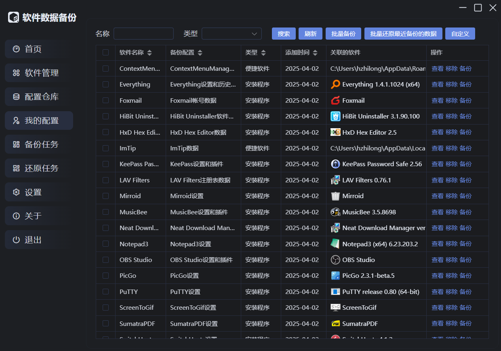
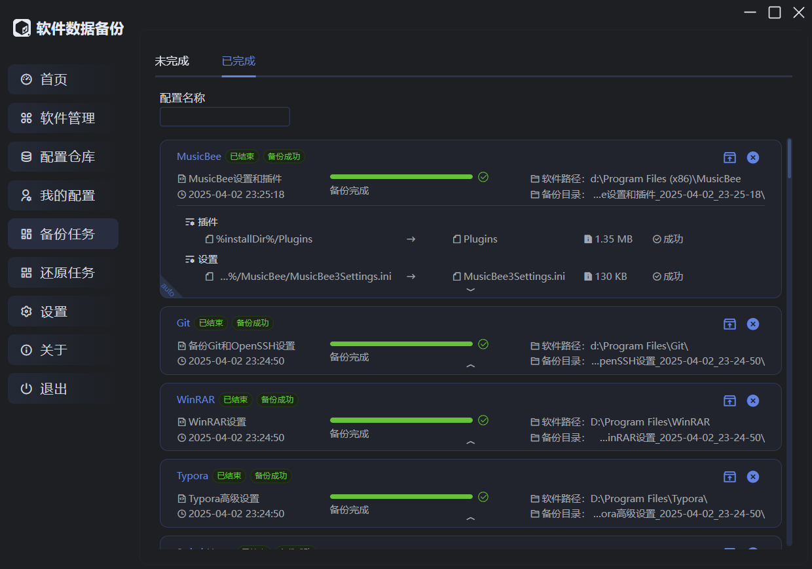
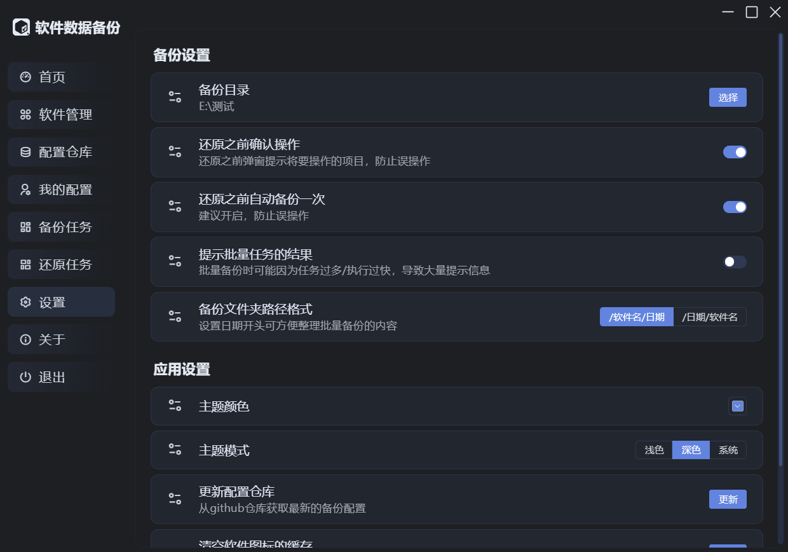

# 软件数据备份

 

## 主要功能：

Windows 软件数据备份还原工具。
通过配置模板实现软件数据的精准备份和还原，方便更换设备、重装系统时实现软件数据迁移。

技术栈：Vue3 + TS + Electron + ElementPlus + Dexie

## 核心功能

- 扫描已安装软件，匹配备份配置
- 用户配置组管理，批量操作，支持批量还原最新的备份数据
- 支持自定义备份配置
- 操作安全，还原操作弹窗确认、自动备份

> 目前内置的备份配置较少，欢迎大家提issue反馈，或者直接[编写配置](./doc/dev/备份配置的编写.md)提交到仓库。

## 软件截图

配置管理

备份任务

设置

## 致谢

- [RemixIcon](https://github.com/Remix-Design/RemixIcon)
- [node-regedit](https://github.com/kessler/node-regedit)
